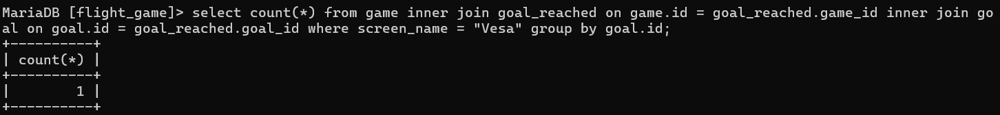

MODULE 3:

teht 1:
select * from goal;

teht 2:
select name, type from airport where iso_country = "FI";

teht 3:
select name from airport where iso_country = "FI" order by name;

teht 4:
select name, type from airport where iso_country = "FI" order by type, name;

teht 5:
select name from country where name like "F%";

teht 6:
select name from country where name like "%F%";

teht 7:
select location from game where screen_name = "Vesa";

teht 8:
select co2_consumed from game where screen_name = "Ilkka";

teht 9:
select distinct co2_budget from game;

MODULE 4:

teht 1:
select country.name as "country name", airport.name as "airport name" from country, airport where airport.iso_country = country.iso_country and country.name = "Iceland";

teht 2:
select airport.name as "airport name" from airport, country where airport.iso_country = country.iso_country and country.name = "France" and airport.type = "large_airport";

teht 3:
select country.name as "country_name", airport.name as "airport_name" from airport, country where airport.iso_country = country.iso_country and country.continent = "AN";

teht 4:
select airport.elevation_ft from airport, game where game.location = airport.ident and game.screen_name = "Heini";

teht 5:
select airport.elevation_ft * 0.3048 as elevation_m from airport, game where game.location = airport.ident and game.screen_name = "Heini";

teht 6:
select airport.name from airport, game where game.location = airport.ident and game.screen_name = "Ilkka";

teht 7:
select country.name from airport, game, country where game.location = airport.ident and airport.iso_country = country.iso_country and game.screen_name = "Ilkka";

teht 8:
select distinct goal.name from goal_reached, goal, game where game.screen_name = "Heini" and goal_reached.game_id = game.id and goal_reached.goal_id = goal.id;

teht 9:
select airport.name from airport, game, goal_reached, goal where game.screen_name = "Ilkka" and goal.name = "clouds" and airport.ident = game.location and game.id = goal_reached.game_id and goal_reached.goal_id = goal.id;

teht 10:
select country.name from airport, game, goal_reached, goal, country where game.screen_name = "Ilkka" and goal.name = "clouds" and airport.ident = game.location and game.id = goal_reached.game_id and goal_reached.goal_id = goal.id and airport.iso_country = country.iso_country;

MODULE 5:

teht 1:
select country.name as "country name", airport.name as "airport name" from airport inner join country on airport.iso_country = country.iso_country and country.name = "Finland" where airport.scheduled_service = "yes";

teht 2:
select screen_name, airport.name from airport inner join game on game.location = airport.ident;

teht 3:
select screen_name, country.name from game inner join airport on game.location = airport.ident inner join country on country.iso_country = airport.iso_country;

teht 4:
select airport.name, screen_name from airport left join game on game.location = airport.ident where airport.name like "%hels%";

teht 5:
select goal.name, screen_name from game right join goal_reached on game.id = goal_reached.game_id right join goal on goal.id = goal_reached.goal_id;

MODULE 6:

teht 1:
select name from country where iso_country in(select iso_country from airport where name like "Satsuma%");

teht 2:
select name from airport where iso_country in(select iso_country from country where name = "Monaco");

teht 3:
select screen_name from game where id in(select game_id from goal_reached where goal_id in(select id from goal where name = "CLOUDS"));

teht 4:
select name from country where iso_country not in(select iso_country from airport);

teht 5:
select name from goal where id not in(select goal_id from goal_reached where game_id in(select id from game where screen_name = "Heini"));

MODULE 7:

teht 1:
select max(elevation_ft) from airport;

teht 2:
select continent, count(*) from country group by continent;

teht 3:
select screen_name, count(*) from game inner join goal_reached on game.id = goal_reached.game_id inner join goal on goal.id = goal_reached.goal_id group by screen_name;

teht 4:
select screen_name from game where co2_consumed in(select min(co2_consumed) from game);

teht 5:
select country.name, count(*) from country inner join airport on country.iso_country = airport.iso_country group by country.name order by count(*) desc limit 50;

teht 6:
select country.name from country inner join airport on country.iso_country = airport.iso_country group by country.name having count(*) >= 1000;

teht 7:
select name from airport where elevation_ft in(select max(elevation_ft) from airport);

teht 8:
select country.name from country inner join airport on airport.iso_country = country.iso_country where elevation_ft in(select max(elevation_ft) from airport);

teht 9:
select count(*) from game inner join goal_reached on game.id = goal_reached.game_id inner join goal on goal.id = goal_reached.goal_id where screen_name = "Vesa" group by goal.id;

teht 10:
select name from airport where latitude_deg in(select min(latitude_deg) from airport);

MODULE 8:

teht 1:
update game set game.location = (select ident from airport where name = "Nottingham Airport"), game.co2_consumed = (select co2_consumed + 500 from game where screen_name = "Vesa") where screen_name = "Vesa"; 

teht 2:
a. goal_reached

teht 3:
delete from goal_reached;

teht 4:
delete from game;
